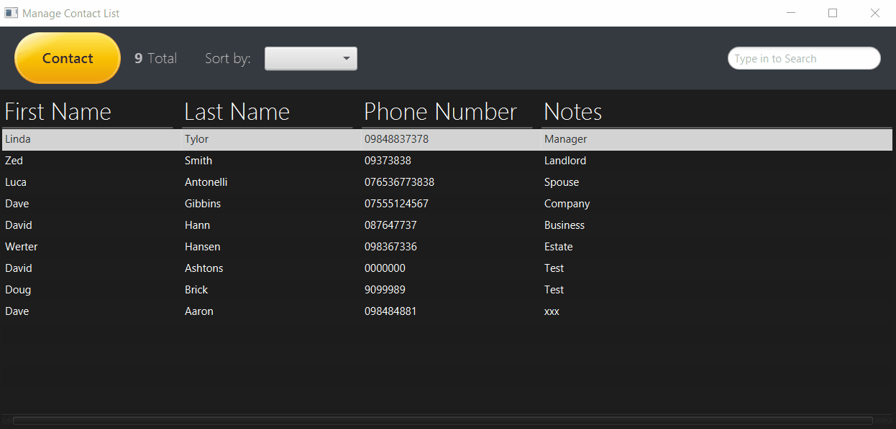

# MY CONTACT MANAGER

 A contact management application lets you add, delete, edit, and sort your contacts.
 
 ## DEMO
 

 ### Why I built this application? :thinking:
 This is actually a challenge project from Tim Buchalka's [Java Programming Masterclass](https://www.udemy.com/course/java-the-complete-java-developer-course/).
 ### Built With 🔨
 * [Java](https://www.oracle.com/java/technologies/);
 * [JavaFX](https://openjfx.io/);
 * [CSS](https://developer.mozilla.org/en-US/docs/Web/CSS);
 * [Scene Builder](https://gluonhq.com/products/scene-builder/);
 
 ### Tasks List :clipboard:
 - [x] Add new contact
 - [x] Edit existing contact
 - [x] Delete selected contact
 - [x] Sort contacts
 - [x] Search for contact
 - [x] Recreate UI design
 
 ## Bugs fixed 🐛
 - [x] While typing a word on search field, sort can be toggled.
 - [x] After completing search, if sort button is toggled, display sorted data according to choice. 
 - [x] When a sort choice is toggled, if texting on search field, show sorted data.
 - [x] Make UI more handsome - NOW MORE HANDSOME DESIGN! 💘
 
 ### Download ⬇
 You are free to download and use my code.
   
 ### Contact me 📭
 Derya Antonelli - [Twitter](https://twitter.com/antonelli_a); derya.antonelli@gmail.com
 
